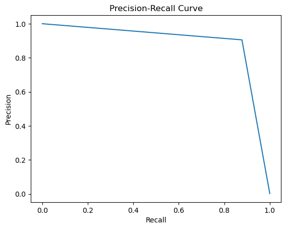
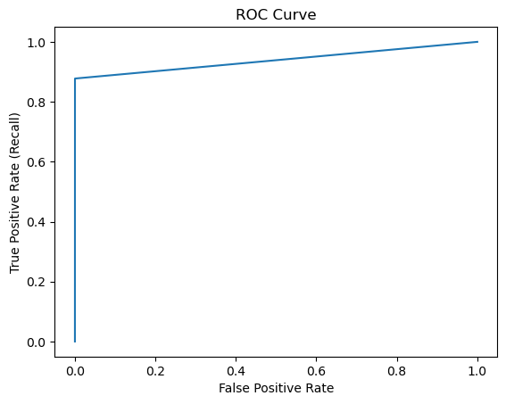

# 💳 Credit Card Fraud Detection (XGBoost)

## 📌 Project Overview
This project focuses on detecting fraudulent credit card transactions in a highly imbalanced dataset, where fraudulent transactions represent only **0.17%** of all data points.

Instead of relying on misleading metrics like accuracy (which can be 99.8% even if the model detects zero fraud), this project emphasizes **Precision-Recall AUC (PR-AUC)**, **Recall**, and confusion matrix analysis. 

The final model, an **XGBoost Classifier with class weighting**, achieved a **PR-AUC of 0.89**, successfully detecting 88% of fraud cases while maintaining high precision.

---

## 📂 Dataset
**Source:** [Kaggle Credit Card Fraud Detection Dataset](https://www.kaggle.com/datasets/mlg-ulb/creditcardfraud)  
**Volume:** 284,807 Transactions  
**Fraud Cases:** 492 (0.172%)  

**Features:**
- **Time:** Seconds elapsed between transactions.
- **Amount:** Transaction amount.
- **V1–V28:** Anonymized PCA-transformed features (original features hidden for confidentiality).
- **Class:** Target variable (1 = Fraud, 0 = Non-Fraud).

---

## 🚧 Key Challenges
* **Extreme Class Imbalance:** Fraud is a "needle in a haystack" event.
* **Cost of Misclassification:** False Negatives (missed fraud) are extremely costly; False Positives (annoying the user) are undesirable but manageable.
* **Metric Trap:** Standard accuracy is useless here. A dummy classifier predicting "No Fraud" for everyone would have 99.8% accuracy but 0% recall.

---

## ⚙️ Methodology

### 1. Train–Test Split
I used **Stratified Sampling** to ensure the test set has the same proportion of fraud cases as the training set, which is crucial for valid evaluation.
```python
X_train, X_test, y_train, y_test = train_test_split(
    X, y, test_size=0.2, random_state=1, stratify=y
)
```

### 2. Handling Class Imbalance
Instead of using synthetic oversampling (like SMOTE), which can sometimes introduce noise, I used **Class Weighting** within the XGBoost algorithm. This penalizes the model more heavily for missing a fraud case.

```python
# Ratio of Negative to Positive samples
scale_pos_weight = 580 
```

### 3. Model Selection
I evaluated multiple approaches (including Logistic Regression and Random Forest), but **XGBoost** was selected for the final deployment due to its superior PR-AUC score and speed.

---

## 📊 Evaluation Metrics
* **Precision:** When the model predicts fraud, how often is it correct?
* **Recall (Sensitivity):** Out of all actual fraud cases, how many did we catch?
* **PR-AUC:** The Area Under the Precision-Recall Curve. (The gold standard for imbalanced classification).
* **ROC-AUC:** Used for overall ranking performance.

---

## 🏆 Final Model Performance (XGBoost)

| Metric | Score |
| :--- | :--- |
| **ROC-AUC** | 0.990 |
| **PR-AUC** | **0.895** |

### Confusion Matrix
```text
                 Predicted Non-Fraud   Predicted Fraud
Actual Non-Fraud        56,855                9
Actual Fraud               12                86
```
*The model successfully detected **86 out of 98** fraud cases in the test set, with only 9 false alarms out of 56,000+ normal transactions.*

### Classification Report
| Class | Precision | Recall | F1-Score | Support |
| :--- | :--- | :--- | :--- | :--- |
| **0 (Normal)** | 1.00 | 1.00 | 1.00 | 56,864 |
| **1 (Fraud)** | **0.91** | **0.88** | **0.89** | 98 |

---

## 📈 Visualizations

### Precision-Recall Curve


### ROC Curve


---

## 🧠 Key Learnings & Limitations
* **Accuracy is misleading:** Relying on accuracy would have hidden the model's true performance.
* **Class Weighting vs. SMOTE:** In this specific dataset, adjusting `scale_pos_weight` was sufficient and computationally faster than oversampling.
* **Limitation:** The dataset lacks user-level context (e.g., "Is this the first time the user bought from this store?"). Real-world systems would require historical features.

---

## 💻 How to Run
1.  Clone the repository.
2.  Download `creditcard.csv` from Kaggle and place it in the root directory.
3.  Install dependencies:
    ```bash
    pip install numpy pandas scikit-learn xgboost matplotlib
    ```
4.  Run the notebook:
    ```bash
    jupyter notebook credit_card.ipynb
    ```

---